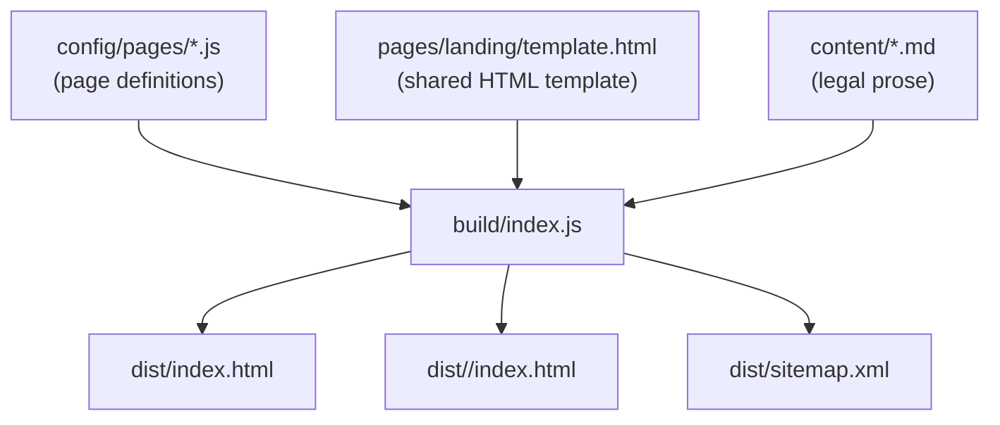

# Landing Template

Static site generator for landing pages. Define pages in JS config, build to `dist/`, and deploy the output to any static host.

> **How it works:** each landing page lives in `config/pages/*.js`, `page.path` is the public URL, and the build writes fully rendered HTML directly to that route inside `dist/`. Legal pages are generated from Markdown the same way.

## Contents

- [Architecture](#architecture)
- [Prerequisites](#prerequisites)
- [Quickstart](#quickstart)
- [Key Features](#key-features)
- [Build Pipeline](#build-pipeline)
- [Adding a New Landing Page](#adding-a-new-landing-page)
- [SEO Setup](#seo-setup)
- [Analytics Setup](#analytics-setup)
- [Legal Content](#legal-content)
- [Assets and Favicon](#assets-and-favicon)
- [Quality and Security](#quality-and-security)
- [Deployment](#deployment)

## Architecture



1. The build reads each landing page config from `config/pages/*.js`.
2. `page.path` is normalized and becomes the public route and output location.
3. The build stamps page content into `pages/landing/template.html`, injects SEO at build time, and writes HTML into `dist/`.
4. Legal pages are generated from `content/*.md` plus `config/legal.js` into their public paths inside `dist/`.
5. `dist/` is the deploy artifact.

## Prerequisites

- Node.js `>=20.0.0 <21.0.0`
- [Bun](https://bun.sh) `>=1.2.7`
- Python 3 (for repo-local Semgrep and Lizard bootstrapping)
- `curl` and `tar` available on `PATH` (for repo-local CLI downloads)

## Quickstart

```bash
bun install
npm run setup:hooks
npm run build
npm run start
```

Open: `http://localhost:3001`

`setup:hooks` also bootstraps pinned repo-local copies of `shellcheck`, `shfmt`, `semgrep`,
`lizard`, `gitleaks`, and `osv-scanner` under `linting/.tools/`.

## Key Features

- **Path-driven generation.** `page.path` is the single source of truth for each landing page URL. Nested routes are supported.
- **Fully built static HTML.** Canonical tags, meta tags, Open Graph, Twitter tags, and JSON-LD are rendered during the build.
- **Consent-gated analytics.** Consent and analytics runtime scripts remain shared, but analytics config is injected at build time.
- **Markdown legal pages.** Privacy and terms content stays in Markdown while metadata stays in config.
- **Static-host friendly output.** Pages are emitted directly at their final public paths inside `dist/`, so normal landing and legal routes do not need rewrite bookkeeping.
- **Strict quality gates.** Linting, formatting, duplication detection, complexity checks, and security scanning are included.

## Build Pipeline

`npm run build` performs three steps:

1. Generate landing pages from `pages/landing/template.html` using each file in `config/pages/*.js`
2. Generate legal pages from Markdown (`content/*.md`) plus `config/legal.js`
3. Generate `dist/sitemap.xml` from all emitted pages

Generated output examples:

```text
dist/index.html
dist/pricing/index.html
dist/product/waitlist/index.html
dist/privacy/index.html
dist/terms/index.html
dist/sitemap.xml
```

## Adding a New Landing Page

1. Copy a page config:

```bash
cp config/pages/default.js config/pages/pricing.js
```

1. Update `config/pages/pricing.js`:

- `path` is required and is the public URL, for example `'/pricing'` or `'/product/waitlist'`
- `title` and `description`
- Hero text and CTA fields
- `features` array
- `published` set to `false` if the page should stay out of the build output

1. Rebuild:

```bash
npm run build
```

No `_redirects` entry is needed for normal landing pages.

## Navigation Setup

- Global nav defaults live in `config/site.js` (`navigation` array).
- Per-page nav overrides can be added in each `config/pages/*.js` (`navigation` array).
- The build step renders nav links into `{{NAV_LINKS}}` in `pages/landing/template.html`.

## SEO Setup

- **Site-level defaults:** `config/site.js`
- **Page-level metadata:** `config/pages/*.js`
- **Build time only:** SEO tags are injected directly into generated HTML

There is no landing-page SEO hydration step in the browser.

## Analytics Setup

Analytics is disabled by default. Configure it in `config/analytics.js`; the build injects that config into generated pages before `shared/analytics.js` runs.

Example:

```js
module.exports = {
  mixpanel: 'YOUR_MIXPANEL_TOKEN',
  ga: 'G-XXXXXXXXXX',
  gaCdnUrl: 'https://www.googletagmanager.com/gtag/js',
  mixpanelCdnUrl: 'https://cdn.mxpnl.com/libs/mixpanel-2-latest.min.js',
  mixpanelPersistence: 'localStorage',
  mixpanelRecordSessionsPercent: 100,
  mixpanelRecordMaskTextSelector: '',
  mixpanelDebug: false,
  mixpanelTrackPageview: true,
  mixpanelScrollDepths: [25, 50, 75, 100],
};
```

- Consent is handled by `shared/consent.js`.
- CTA click tracking works automatically on elements with `data-track-cta`.

## Legal Content

Edit `content/privacy.md` and `content/terms.md`. Template placeholders supported in Markdown:

- `{{ORG_NAME}}`
- `{{BASE_URL}}`
- `{{ADMIN_EMAIL}}`
- `{{PRIVACY_EMAIL}}`
- `{{CONTACT_EMAIL}}`

## Assets and Favicon

- Put your favicon at the repo root: `favicon.ico`
- Add marketing assets inside `assets/` (images, videos, fonts, favicons)
- Update references in templates and config as needed

## Quality and Security

Install the repo-local tooling once after cloning if you want lint, hooks, or security scans
without installing those CLIs globally:

```bash
npm run setup:tooling
```

```bash
npm run lint
npm run lint:fix
npm run format
npm run format:check
npm run security:scan
```

### Git Hooks

```bash
npm run setup:hooks
```

`setup:hooks` installs the Git hook path and bootstraps the repo-local lint/security tooling.
Hooks run lint and security checks on commit and push. Bypass options are listed by
`setup:hooks` output.

## Deployment

### Cloudflare Pages

- **Build command:** `npm run build`
- **Output directory:** `dist`
- `_redirects` is only for explicit redirects you want to add
- Security and caching headers are controlled by `_headers`

### Any Static Host

- Upload `dist/`
- Serve its files as-is
- Add redirects only if you want aliases or legacy URL forwarding
