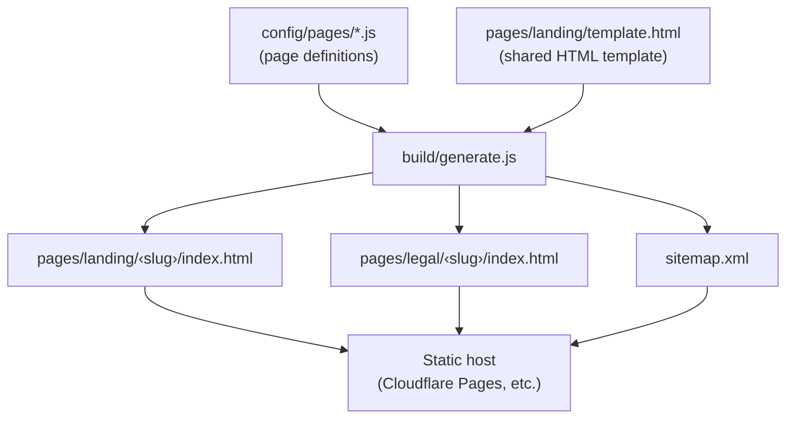

# Landing Template

Static site generator for landing pages. Define pages in JS config, build to static HTML, deploy anywhere.

> **How it works:** Each landing page is defined as a JS config file in `config/pages/`. The build script stamps each config into a shared HTML template, injects SEO tags, generates legal pages from Markdown, and outputs pure static HTML. No framework or runtime used.

## Contents

- [Architecture](#architecture)
- [Prerequisites](#prerequisites)
- [Quickstart](#quickstart)
- [Key Features](#key-features)
- [Build Pipeline](#build-pipeline)
- [Adding a New Landing Page](#adding-a-new-landing-page)
- [Navigation Setup](#navigation-setup)
- [SEO Setup](#seo-setup)
- [Analytics Setup](#analytics-setup)
- [Legal Content](#legal-content)
- [Assets and Favicon](#assets-and-favicon)
- [Quality and Security](#quality-and-security)
- [Deployment](#deployment)

## Architecture



1. The build reads each page config from `config/pages/*.js` and the shared template from `pages/landing/template.html`.
2. For each config, it replaces template placeholders with page-specific content (hero text, CTAs, features, nav, SEO tags).
3. Legal pages are generated from Markdown files in `content/` using `pages/legal/template.html`.
4. A `sitemap.xml` is generated from all published pages.
5. The output is plain static HTML - serve it from any host with no build tools at runtime.

## Prerequisites

- Node.js `>=20.0.0 <21.0.0`
- [Bun](https://bun.sh) `>=1.2.7`

## Quickstart

```bash
bun install
npm run setup:hooks
npm run build
npm run start
```

Open: `http://localhost:3001`

## Key Features

- **Static page generation from reusable templates.** Define any number of landing pages as JS config files. The build script stamps each one into a shared HTML template - no duplication, no framework overhead.
- **Built-in SEO generation.** Meta tags, Open Graph, and JSON-LD are injected at build time from page config. A runtime script in `shared/seo.js` keeps tags in sync when config loads in the browser.
- **Analytics with consent gating.** Google Analytics and Mixpanel integration points are included but disabled by default. Tracking only initializes after the user accepts consent via `shared/consent.js`.
- **Legal page generation from Markdown.** Privacy and terms pages are authored in Markdown (`content/privacy.md`, `content/terms.md`) with template placeholders for org name, URLs, and contact emails.
- **Cloudflare Pages-ready routing.** `_redirects`, `_headers`, and `functions/_middleware.js` are pre-configured for Cloudflare Pages. Adaptable to any static host.
- **Strict quality gates.** Linting, formatting, complexity analysis, duplication detection, and security scanning are built in. Git hooks enforce checks on commit and push.

## Build Pipeline

`npm run build` performs three steps:

1. Generate landing pages from `pages/landing/template.html` using each config in `config/pages/*.js`
2. Generate legal pages from Markdown (`content/*.md`) into `pages/legal/*/index.html`
3. Generate `sitemap.xml` from all published pages

Generated output:

```text
pages/landing/<slug>/index.html
pages/legal/<slug>/index.html
sitemap.xml
```

## Adding a New Landing Page

1. Copy a page config:

```bash
cp config/pages/default.js config/pages/pricing.js
```

1. Update `config/pages/pricing.js`:

- `path` (e.g. `'/pricing'`)
- `title` and `description`
- Hero text and CTA fields
- `features` array
- `published` (`false` until ready)

1. Add a route to `_redirects`:

```text
/pricing /pages/landing/pricing/ 200
```

1. Rebuild:

```bash
npm run build
```

## Navigation Setup

- Global nav defaults live in `config/site.js` (`navigation` array).
- Per-page nav overrides can be added in each `config/pages/*.js` (`navigation` array).
- The build step renders nav links into `{{NAV_LINKS}}` in `pages/landing/template.html`.

## SEO Setup

- **Site-level defaults:** `config/site.js`
- **Page-level metadata:** `config/pages/*.js`
- **Build time:** SEO tags are injected directly into generated HTML.
- **Runtime:** `shared/seo.js` keeps tags in sync when page config loads in the browser.

## Analytics Setup

> Analytics is disabled by default. Tracking only initializes after the user accepts consent.

`config/analytics.js` includes stub defaults and merge logic. To enable tracking, set values before `shared/analytics.js` executes (e.g. in the template head):

```html
<script>
  window.ANALYTICS_CONFIG = {
    mixpanel: 'YOUR_MIXPANEL_TOKEN',
    ga: 'G-XXXXXXXXXX',
  };
</script>
```

- Consent is handled by `shared/consent.js`.
- CTA click tracking works automatically on elements with `data-track-cta`.

## Legal Content

Edit `content/privacy.md` and `content/terms.md`. Template placeholders supported in Markdown:

- `{{ORG_NAME}}`
- `{{BASE_URL}}`
- `{{ADMIN_EMAIL}}`
- `{{PRIVACY_EMAIL}}`
- `{{CONTACT_EMAIL}}`

## Assets and Favicon

- Put your favicon at the repo root: `favicon.ico`
- Add marketing assets inside `assets/` (images, videos, fonts, favicons)
- Update references in templates and config as needed

## Quality and Security

```bash
npm run lint
npm run lint:fix
npm run format
npm run format:check
npm run security:scan
```

### Git Hooks

```bash
npm run setup:hooks
```

Hooks run lint and security checks on commit and push. Bypass options are listed by `setup:hooks` output.

## Deployment

### Cloudflare Pages

- **Build command:** `npm run build`
- **Output directory:** repository root (`/`)
- Routing controlled by `_redirects`
- Security and caching headers controlled by `_headers`
- Middleware logic in `functions/_middleware.js`

### Any Static Host

- Upload the repository after running `npm run build`
- Replicate rewrite rules from `_redirects`
- Serve generated HTML and static assets as plain files
